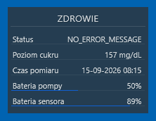

# CareLink Rainmeter Bridge

Pomost pomiędzy systemem CareLink a Rainmeterem, umożliwiający wyświetlanie aktualnego poziomu glukozy bezpośrednio na pulpicie systemu Windows.

<p align="center">
  
</p>

## Elementy w repozytorium

Projekt składa się z kilku elementów, które wspólnie tworzą łańcuch umożliwiający pobranie danych z pompy insulinowej i ich prezentację na pulpicie:

```text
CareLink Rainmeter Bridge/
│
├── API proxy/
│
└── Rainmeter skin/
    └── illustro pro/
```

### `API proxy/`

Skrypt PHP pełniący rolę bezpiecznej warstwy pośredniej pomiędzy lokalnym proxy CareLink a Rainmeterem.

Podgląd moich aktualnych danych dostępny jest pod adresem [https://api.kucharskov.pl/cgm/](https://api.kucharskov.pl/cgm/) (live demo).

Osobiście używam tego komponentu do filtracji danych dla [https://cgm.kucharskov.pl/](https://cgm.kucharskov.pl/) - status mojej glukozy w sieci.

### `Rainmeter skin/`

Kompletna skórka Rainmeter oparta na stylu **illustro pro**, zmodyfikowana w celu prezentowania danych dotyczących poziomu glukozy.

Poszczególne elementy odpowiadają za:

* **Pompa insulinowa → CareLink** — komunikacja i synchronizacja danych realizowana przez system **Medtronic CareLink**.
* **CareLink → lokalne proxy** — za komunikację odpowiada projekt [`carelink-python-client`](https://github.com/ondrej1024/carelink-python-client) autorstwa **ondrej1024**.
* **Lokalne proxy → API Proxy** — znajdujący się w tym repozytorium skrypt PHP pobiera dane z lokalnego proxy i udostępnia na zewnątrz wyłącznie wybrane, przefiltrowane informacje.
* **API Proxy → Rainmeter** — skórka Rainmeter znajdująca się w tym repozytorium regularnie odpytuje API Proxy za pomocą `Plugin=WebParser` i prezentuje aktualny poziom glukozy w czytelnej formie na pulpicie.

## Dlaczego API Proxy?

Skrypt PHP pełni rolę dodatkowej warstwy pośredniej pomiędzy lokalnym proxy a Rainmeterem. Dzięki temu dane z `carelink-python-client` są udostępniane tylko lokalnie, a publicznie dostępne są jedynie przefiltrowane informacje.

## Wymagania i instalacja

Projekt zakłada działanie trzech elementów:

1. Lokalnego proxy `carelink-python-client`
2. Publicznie dostępnego API Proxy w PHP
3. Skórki Rainmeter

### 1. Lokalne proxy CareLink

Najpierw należy skonfigurować i uruchomić projekt [`ondrej1024/carelink-python-client`](https://github.com/ondrej1024/carelink-python-client)

W pliku `carelink_client2_proxy.py` należy zmienić wartość:

```python
HOSTNAME = "0.0.0.0"
```

na:

```python
HOSTNAME = "127.0.0.1"
```

Dzięki temu proxy będzie nasłuchiwało wyłącznie lokalnie i nie będzie bezpośrednio dostępne z sieci.

### 2. API Proxy

Katalog ``API proxy`` zawiera skrypt PHP odpowiedzialny za pobranie danych z lokalnego proxy oraz ich filtrowanie.

Skrypt musi działać na serwerze WWW, który:

* ma możliwość wykonywania skryptów PHP,
* może komunikować się z adresem proxy CareLink (domyślnie `127.0.0.1:8081`),
* jest dostępny dla Rainmetera przez internet lub sieć lokalną.

Po umieszczeniu skryptu na serwerze należy sprawdzić, czy jego publiczny adres WWW zwraca prawidłowe, przefiltrowane dane.

### 3. Rainmeter

Katalog ``Rainmeter skin`` zawiera kompletną skórkę Rainmeter.

Należy skopiować znajdujący się w nim katalog motywu do katalogu skórek Rainmetera.

Przykładowa lokalizacja:

```text
...\Dokumenty\Rainmeter\Skins\illustro pro\Health
```

Po skopiowaniu motywu należy otworzyć plik ``Health mod.ini`` i zmienić wartość:

```ini
UrlAPI=[...](https://example.com/api.php)
```

na adres WWW własnego API Proxy, np.:

```ini
UrlAPI=https://api.kucharskov.pl/cgm/
```

Po odświeżeniu motywu Rainmeter powinien rozpocząć regularne pobieranie danych za pomocą `Plugin=WebParser` i wyświetlać aktualny poziom glukozy.

## Credits

Projekt powstał dzięki pracy i rozwiązaniom innych autorów.

- [`carelink-python-client`](https://github.com/ondrej1024/carelink-python-client) - Stanowi podstawę komunikacji z CareLink i jest kluczowym elementem całego rozwiązania. 
- illustro pro - Warstwa wizualna skórki Rainmeter bazuje na stylu **illustro pro**, którego autorem jest użytkownik **pein**.

## Klauzula

Projekt został stworzony wyłącznie w celach edukacyjnych i informacyjnych. Opiera się na szeregu zależności, założeń i komponentów, z których każdy może przestać działać w dowolnym momencie, między innymi w wyniku zmian po stronie CareLink lub innych wykorzystywanych usług. Projekt nie jest zatwierdzony przez FDA ani żadną inną instytucję regulacyjną i **nie powinien być wykorzystywany do podejmowania decyzji dotyczących leczenia, dawkowania insuliny ani innych decyzji medycznych**. Nie jest on powiązany z firmą Medtronic, nie jest przez nią wspierany ani przez nią zatwierdzony, a jego wykorzystanie może być niezgodne z warunkami korzystania z usług CareLink. Kod jest udostępniany **bez jakiejkolwiek gwarancji, zapewnienia poprawności działania lub formalnego wsparcia**. Korzystasz z niego na własną odpowiedzialność.
